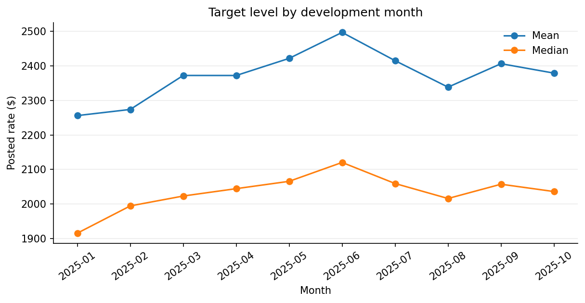
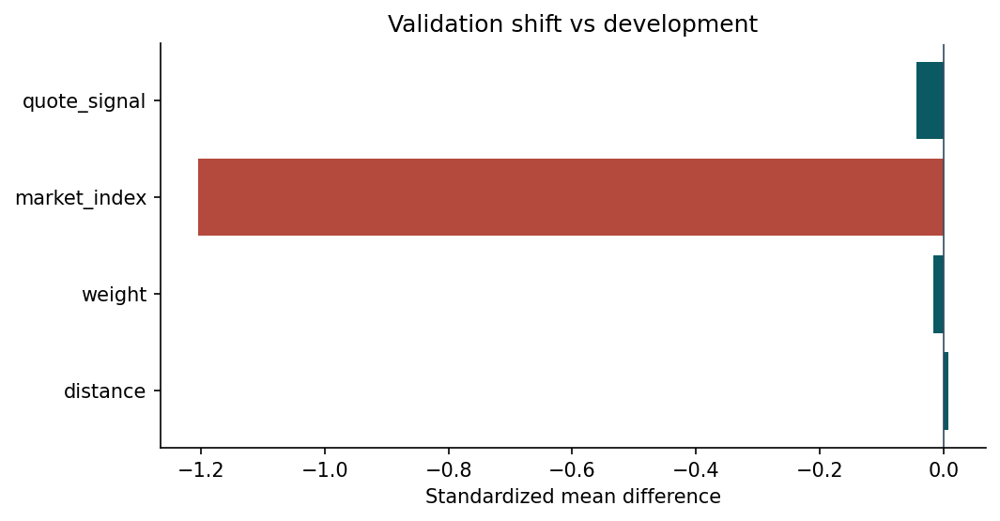
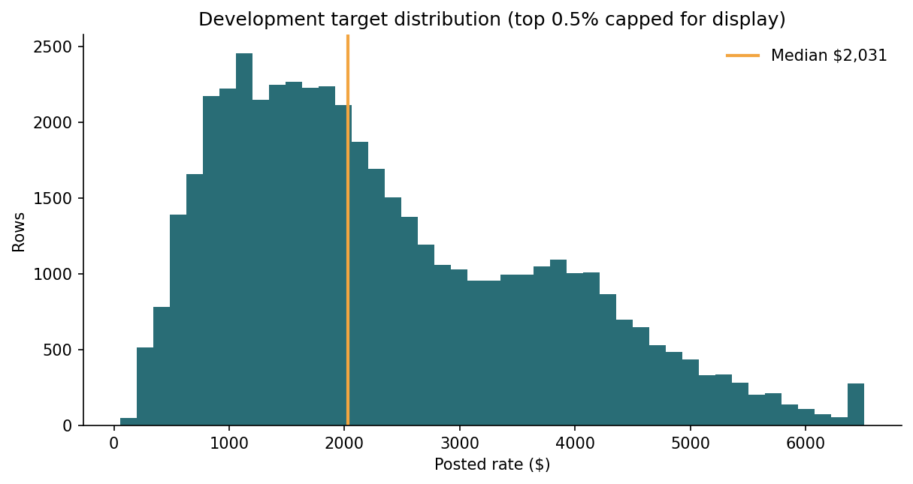
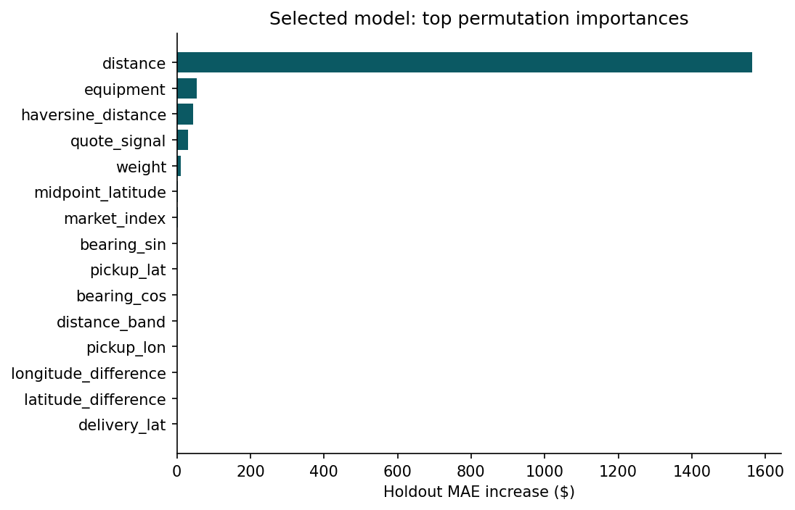
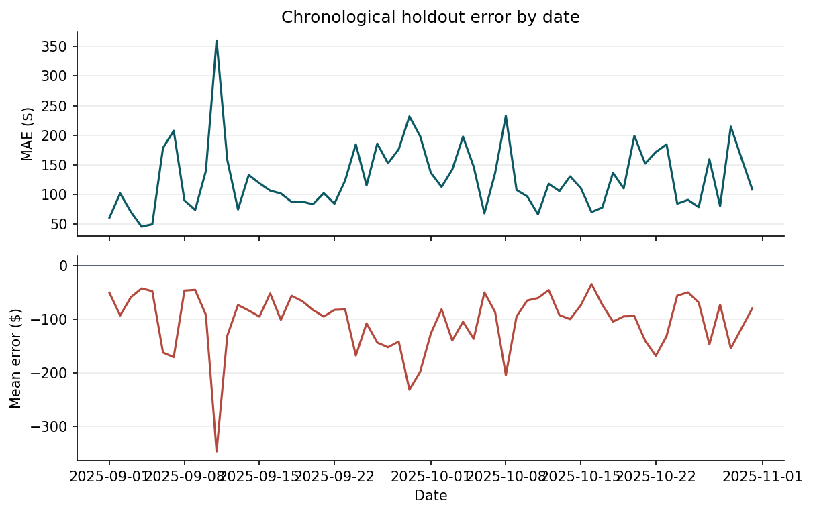
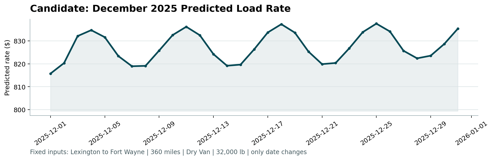

# Freight Rate Prediction Pipeline

[](https://www.python.org/)
[](https://scikit-learn.org/)
[](https://catboost.ai/)
[](#reproducibility)

An end-to-end machine-learning pipeline for forecasting freight rates on future loads. The project emphasizes **chronological validation, leakage-safe feature engineering, model-family-neutral selection, reproducible execution, and submission-grade output validation**.

Originally developed from a time-constrained ML engineering brief, the repository is structured as a reusable portfolio project rather than a one-off notebook.

---

## Project highlights

- **48,000** labeled development rows and **12,000** future validation rows
- A blocked chronological holdout that mirrors the final two-month forecast horizon
- Training-only feature screening across both **HistGradientBoostingRegressor** and **CatBoostRegressor**
- Separate reduced-schema model selection for the fixed December route series
- Automated data audits, comparison tables, error analysis, prediction generation, and scorer execution
- Deterministic candidate ordering, stable row sorting, fixed seeds, and machine-readable-artifact consistency checks

### Chronological validation results

| Output | Selected model | Feature set | Validation MAE |
|---|---|---|---:|
| Main validation | `hgb_compact` | `basic_plus_geographic` | **$129.51** |
| December scenario | `december_hgb__december_basic` | `december_basic` | **$108.78** |

The values above are chronological model-selection validation scores. They are not metrics from the unlabeled final-validation set.

---

## Visual results

### Target behaviour over time



### Development-to-validation distribution shift



### Target distribution



### Selected-model feature importance



### Holdout error over time



### Fixed December prediction series



---

## Modelling workflow

```mermaid
flowchart LR
    A[Raw development and validation data] --> B[Schema and data-quality audit]
    B --> C[Chronological outer split]
    C --> D[Training-only inner split]
    D --> E[Feature screening with HGB and CatBoost]
    E --> F[Freeze common feature set and CatBoost iterations]
    F --> G[Outer candidate comparison]
    G --> H[Select minimum-MAE eligible model]
    H --> I[Refit on all labeled development rows]
    I --> J[Generate 12,000 validation predictions]
    C --> K[Reduced-schema December comparison]
    K --> L[Refit December-compatible model]
    L --> M[Generate 31 fixed December predictions]
    J --> N[Validate schemas and run supplied scorer]
    M --> N
    N --> O[Generate predictions, metrics, figures, scorer outputs, and consistency checks for machine-readable artifacts]
```



---

## Objective

Train a leakage-safe freight-rate regressor on the supplied labeled data, predict all **12,000** future validation loads, and generate the fixed Lexington-to-Fort-Wayne December series required by the supplied scorer.

---

## Dataset overview

- **Development:** 48,000 rows from `2025-01-01` through `2025-10-31`
- **Target:** `posted_rate`
- **Final validation:** 12,000 rows from `2025-11-01` through `2025-12-31`
- **December chart input:** 31 fixed rows from `2025-12-01` through `2025-12-31`
- Missing development values occur in `weight` and `market_index`
- Impossible non-positive weights are treated as missing and explicitly flagged
- Valid target extremes are retained rather than silently removed
- `load_id` is read explicitly as text so its exact representation is preserved

---

## Validation strategy

The primary holdout mirrors the future forecasting horizon:

| Split | Date range | Rows |
|---|---|---:|
| Outer training | `2025-01-01` to `2025-08-31` | 38,477 |
| Outer holdout | `2025-09-01` to `2025-10-31` | 9,523 |
| Final validation | `2025-11-01` to `2025-12-31` | 12,000 |

Feature groups and CatBoost iteration counts are decided on a separate training-only chronological window:

| Inner split | Date range |
|---|---|
| Inner training | through `2025-07-01` |
| Inner validation | `2025-07-02` to `2025-08-31` |

Fixed HGB and CatBoost proxies evaluate every logical feature set on the same fold-pure matrices. The feature list with the lowest equal-family mean MAE is frozen before outer-holdout scoring.

The outer holdout is used only for:

1. final candidate selection,
2. model diagnostics,
3. error analysis.

It is not used to adapt a candidate and then rescore it. Because the same outer holdout is used for final candidate selection and reporting, the resulting MAE is described as **chronological validation performance**, not untouched test performance.

### Selection rule

> Select the eligible candidate with the lowest finite MAE on the common chronological holdout. Exact-equality ties are broken deterministically by candidate name.

---

## Features

The selected `basic_plus_geographic` feature set combines supplied operational variables with compact, leakage-safe geographic features.

Feature groups evaluated include:

- supplied distance, equipment, weight, market, and quote fields
- cyclic and calendar date features
- route combinations and training-only frequency signals
- unseen-route and unseen-city indicators
- compact geographic calculations
- defensible distance, weight, and market interactions

`load_id`, `posted_rate`, and `predicted_rate` are never model features. `load_id` is loaded as text and is used only for integrity checks, joins, and output ordering, preserving values such as identifiers with leading zeros.

Historical target encodings were deliberately excluded because sparse routes and chronological leakage risk outweighed their potential value.

---

## Main model

The selected main model is:

```text
HistGradientBoostingRegressor
Candidate: hgb_compact
Feature set: basic_plus_geographic
```

Histogram gradient boosting uses an ordinal categorical encoder fitted only within each training fit. Previously unseen categories map to a reserved value.

### Parameters

```json
{
  "l2_regularization": 3.0,
  "learning_rate": 0.06,
  "max_iter": 250,
  "max_leaf_nodes": 15,
  "min_samples_leaf": 30
}
```

### Chronological holdout performance

| Metric | Value |
|---|---:|
| MAE | **$129.51** |
| RMSE | $640.32 |
| R² | 0.8239 |
| sMAPE | 4.527% |

### Saved inference artifacts

```text
models/final_rate_model.joblib
models/final_inference_bundle.joblib
```

`final_inference_bundle.joblib` stores the fitted feature builder, selected feature columns, trained estimator, target name, and model metadata together. This allows new raw freight-load records to be transformed with the same learned preprocessing used during training before prediction.

The `models/` directory is generated locally and may be excluded from Git because the artifacts are reproducible from the tracked code and data.

---

## December-compatible model

The fixed December input has a reduced schema, so it receives a separate model-selection process.

All eligible December-compatible HGB and CatBoost candidates use:

- the same chronological outer rows,
- rate-per-mile modelling,
- posted-rate MAE,
- identical compatible columns within each feature-set comparison.

The selected model is:

```text
HistGradientBoostingRegressor
Candidate: december_hgb__december_basic
Feature set: december_basic
Holdout MAE: $108.78
```

It uses only fields available in the fixed input plus known date features. Market and quote signals are not fabricated.

> **Why a separate December model?**  
> The supplied December scenario omits `market_index`, `quote_signal`, and coordinate columns available to the main validation model. A separately validated reduced-schema model is therefore used only for the required December scenario chart. It is selected using the same chronological holdout and MAE criterion. The December chart should not be interpreted as output from the main model used for the 12,000 validation predictions.

Generated model path:

```text
models/december_rate_model.joblib
```

---

## Model comparison

| Candidate | Family | Feature set | MAE | Eligible | Selected |
|---|---|---|---:|:---:|:---:|
| `hgb_compact` | HistGradientBoostingRegressor | `basic_plus_geographic` | **129.51** | Yes | **Yes** |
| `hgb_smoother` | HistGradientBoostingRegressor | `basic_plus_geographic` | 130.26 | Yes | No |
| `catboost_rate_per_mile` | CatBoostRegressor | `basic_plus_geographic` | 141.07 | Yes | No |
| `equipment_median_rpm` | Baseline | distance + equipment | 229.10 | No | No |
| `global_median` | Baseline | target only | 1,148.92 | No | No |

Full results:

- [`artifacts/model_comparison.csv`](artifacts/model_comparison.csv)
- [`artifacts/december_model_comparison.csv`](artifacts/december_model_comparison.csv)
- [`artifacts/feature_ablation.csv`](artifacts/feature_ablation.csv)

---

## Repository structure

```text
.
├── README.md
├── requirements.txt
├── run_pipeline.py
├── score.py
├── train-test.csv
├── validation.csv
├── validation-predictions-template.csv
├── validation_predictions.csv
├── december-chart-inputs-template.csv
├── december-chart-inputs.csv
├── src/
│   ├── __init__.py
│   ├── evaluate.py
│   ├── features.py
│   ├── reporting.py
│   └── train.py
├── artifacts/
│   ├── data_audit.json
│   ├── model_comparison.csv
│   ├── december_model_comparison.csv
│   ├── feature_ablation.csv
│   ├── feature_importance.csv
│   ├── error_analysis.csv
│   ├── temporal_stability.csv
│   ├── validation_metrics.json
│   └── scorer_output.txt
├── models/                         # generated locally; Git-ignored
│   ├── final_rate_model.joblib
│   ├── final_inference_bundle.joblib
│   └── december_rate_model.joblib
├── reports/
│   ├── assessment_report.pdf          # static technical report
│   └── figures/
│       ├── distribution_shift.png
│       ├── feature_importance.png
│       ├── holdout_error_over_time.png
│       ├── monthly_target.png
│       └── target_distribution.png
└── scorer_results/
    └── candidate_december.png
```

---

## Setup

Python **3.11+** is recommended.

### Windows PowerShell

```powershell
python -m venv .venv
.venv\Scripts\Activate.ps1
python -m pip install -r requirements.txt
$env:PYTHONHASHSEED = "42"
python run_pipeline.py
```

### macOS/Linux

```bash
python3 -m venv .venv
source .venv/bin/activate
python -m pip install -r requirements.txt
PYTHONHASHSEED=42 python run_pipeline.py
```

The pipeline:

1. locates and validates all supplied files,
2. performs data-quality and distribution-shift audits,
3. creates inner and outer chronological splits,
4. screens feature groups using both model families,
5. compares all eligible final candidates,
6. refits the selected main and December models,
7. generates both required prediction outputs,
8. validates their schemas,
9. executes the unmodified scorer,
10. generates predictions, models, metrics, figures, scorer outputs, and consistency checks for machine-readable artifacts.

`README.md` and `reports/assessment_report.pdf` are static documentation files. The pipeline verifies that they exist but does not generate or overwrite them.

---

## Run the scorer independently

```bash
python score.py \
  --predictions validation_predictions.csv \
  --december-predictions december-chart-inputs.csv
```

On PowerShell:

```powershell
python score.py `
  --predictions validation_predictions.csv `
  --december-predictions december-chart-inputs.csv
```

Successful scorer output is captured in [`artifacts/scorer_output.txt`](artifacts/scorer_output.txt).

The scorer validates the required output structure and generates:

```text
scorer_results/candidate_december.png
```

Local performance values in this repository come from the chronological development holdout.

---

## Outputs and documentation

| Artifact | Type | Purpose |
|---|---|---|
| [`validation_predictions.csv`](validation_predictions.csv) | Generated | Final 12,000-row prediction output |
| [`december-chart-inputs.csv`](december-chart-inputs.csv) | Generated | Completed fixed December scenario |
| [`artifacts/validation_metrics.json`](artifacts/validation_metrics.json) | Generated | Canonical model, split, metrics, and run metadata |
| [`artifacts/model_comparison.csv`](artifacts/model_comparison.csv) | Generated | Main candidate comparison |
| [`artifacts/december_model_comparison.csv`](artifacts/december_model_comparison.csv) | Generated | Reduced-schema December candidate comparison |
| [`artifacts/error_analysis.csv`](artifacts/error_analysis.csv) | Generated | Segment-level chronological validation analysis |
| [`scorer_results/candidate_december.png`](scorer_results/candidate_december.png) | Generated | Fixed December prediction chart |
| `models/final_inference_bundle.joblib` | Generated locally | Fitted preprocessing and main-model inference bundle |
| [`reports/assessment_report.pdf`](reports/assessment_report.pdf) | Static documentation | Technical report containing methodology and the December chart |

### Original project brief

- [`freight-rate-ml-assessment.pdf`](freight-rate-ml-assessment.pdf)
- [`readme spotter.md`](readme%20spotter.md)

---

## Reproducibility

- Fixed random seed: `42`
- Stable `date, load_id` row ordering
- Sorted feature-set and candidate iteration
- Deterministic tie-breaking by candidate name
- CPU-constrained numerical execution
- Candidate-pool assertions for both main and December models
- Saved-model family checks
- Supplied scorer checksum verification
- Pristine December-template checksum verification
- Machine-readable metrics and comparison-table consistency checks
- `load_id` loaded explicitly as text
- Complete preprocessing-and-model inference bundle
- Static README checksum verification during pipeline execution
- `PYTHONHASHSEED=42` supplied before Python starts through the documented run command
- Content-addressed run identity stored in generated JSON artifacts rather than hardcoded in this README

---

## Assumptions and limitations

- The selected feature list depends on one inner chronological window and two fixed proxy families.
- The reported outer-holdout MAE is a model-selection estimate, not an unbiased post-selection test score.
- Final validation includes eight cities absent from development, while the chronological holdout contains no entirely unseen cities; cold-start city performance therefore remains uncertain.
- Market index shows the largest development-to-validation shift.
- Chronological validation reduces future-regime risk but cannot remove it.
- Coordinates appear obfuscated, so supplied distance is treated as authoritative.
- Sparse extreme rates dominate RMSE and are retained rather than silently removed.
- The December chart uses a separately validated reduced-schema scenario model and should not be interpreted as output from the main validation model.
- No external data, credentials, or private APIs are used.

---

## Documentation

- [Technical report](reports/assessment_report.pdf)
- [Scorer output](artifacts/scorer_output.txt)
- [Original project brief](freight-rate-ml-assessment.pdf)

**Video walkthrough:** [Add public Loom link here]
